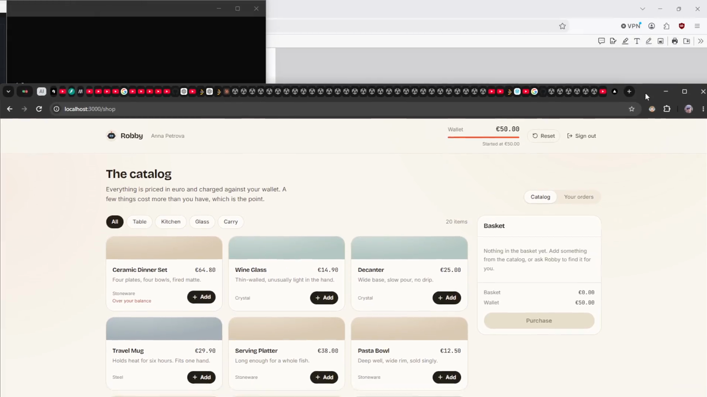

## Architecture proposal
Architecture will be tested throughout https://breakscale.tech/ Breakscale. My favorite source for architecutre load testing.

This is just contrived architecture made to potentially scale. I am using many queries to test just to practice my architectural design.

A read-heavy, globally distributed service. Traffic from four regional populations (two Canada, two Europe) reaches a pair of CDNs. It redirects to the lb in your area. The origin consults a 4-way sharded store and delegates work to an AI agent, which is the sole consumer of the data layer: a cache, a search index, and a database.

100Requests / 1Sec.


5000 Requests / 1Sec.


## Agent architecture

Four agents and a deterministic kernel. The agents may only *propose*; the
kernel is the only code that may act.

```
POST /support   { authenticated_customer_id, message }
                                     ▼
                       ┌───────────────────────────┐
                       │        ORCHESTRATOR       │  owns the turn, the budget,
                       │                           │  and the audit log
                       └─────────────┬─────────────┘
                                     ▼
                       ┌───────────────────────────┐
                       │        TRIAGE AGENT       │  model call #1
                       │        tools: none        │  → { intent, order_refs[],
                       │                           │      claims[], specialist }
                       └─────────────┬─────────────┘
                                     │  routes to exactly ONE specialist
                          ┌──────────┴───────────┐
                          ▼                      ▼
                ┌───────────────────┐  ┌───────────────────┐
                │    ORDER AGENT    │  │    REFUND AGENT   │
                │     read only     │  │   read + propose  │
                ├───────────────────┤  ├───────────────────┤
                │  get_order        │  │  get_order        │
                │  get_shipping     │  │  propose_refund   │
                └─────────┬─────────┘  └─────────┬─────────┘
                          │    proposals only    │
                          └──────────┬───────────┘
                                     ▼
╔═════════════════════════════════════════════════════════════════════════╗
║  POLICY KERNEL                       deterministic · no model involved  ║
╠═════════════════════════════════════════════════════════════════════════╣
║  1. SCHEMA VALIDATE   reject malformed tool calls                       ║
║  2. AUTHORIZE         ownership filter on retrieval       ← scenario 03 ║
║  3. CHECK CONTESTED   claim vs record → escalate          ← scenario 04 ║
║  4. CHECK ELIGIBILITY order state / return state                        ║
║  5. DERIVE AMOUNT     unit_price × qty, from record       ← scenario 02 ║
║  6. CHECK ENVELOPE    ≤ EUR 50 auto, above escalates                    ║
║  7. CHECK IDEMPOTENCY dedupe on (order_id, item_id)                     ║
║  8. EXECUTE + AUDIT   the only code that may write                      ║
╚════════════════════════════════════╦════════════════════════════════════╝
                                     ▼
                       ┌───────────────────────────┐
                       │     RESPONSE COMPOSER     │  model call #N
                       │        tools: none        │  input: kernel-verified
                       │                           │  outcomes ONLY
                       └─────────────┬─────────────┘
                                     ▼
  { reply, outcome, actions[], audit[], tier }
```

# Robby

An AI customer-support assistant for a small homeware shop, and the operator
console that replays every decision it made.

A customer writes in with an already-authenticated customer id. Robby reads the
commerce record, answers order questions, and drafts refunds. He never pays
one: every refund is held for a human operator to approve, and a deterministic
policy kernel sits between what he proposes and what actually happens.

Built for the Senior Engineer (AI Systems) take-home exercise.

## Walkthrough

[](Walkthrough.mp4)

**[Walkthrough.mp4](Walkthrough.mp4)** sits in the root of the project. Three and
a half minutes: the shop, an order question, a lookup refused on ownership, a
refund drafted and held, and the operator console approving it.

GitHub serves committed video as a binary download rather than playing it in the
page, so open the file after cloning or unzipping.

## Run it

### Before you start

**Node 22.18 or newer.** `npm run test` and `npm run scenarios` load TypeScript
directly through Node's native type stripping, which older releases do not have.
On Node 20 they exit with `ERR_UNKNOWN_FILE_EXTENSION`, and the pre-commit hook
fails with them. `npm run dev` alone is fine from Node 20.9.

```bash
node -v        # expect v22.18.0 or newer; this was built and tested on v24
```

Nothing else is needed: no database, no API key, no environment file, no
services to start. The model is mocked, so there is nothing to pay for and
nothing to configure.

### Then

```bash
npm install    # 366 packages, a few seconds
npm run dev
```

Then open http://localhost:3000.

```bash
npm run verify      # typecheck, lint, 143 tests
npm run scenarios   # the supplied examples end to end, with the full trace
npm run reset       # clears what the running app generated, leaves the seed alone
                    # run this before committing: the app writes to data/seed/mutable
```

## Signing in

There is no database and no account store. Two accounts switch roles, and the
sign-in screen offers them as cards rather than as a form pretending to be a
gate.

| Account | Password | Lands on | Is |
| --- | --- | --- | --- |
| `User` | `Test123$` | `/shop` | Anna Petrova, `CUST-001` |
| `Admin` | `Test123$` | `/console` | The operator |

The session is kept in `localStorage` and the route guards are client-side.
That is deliberate for a demo and is not a security boundary. The boundary that
matters is `src/guard/`, which is server-side and is the only path to customer
data.

## Two minutes with it

1. Sign in as Anna. Ask **"what is the status of ORD-200?"** The answer opens on
   the state, the date it arrived, and how much of the refund window is left.
2. Ask **"ORD-204"**. It exists and belongs to somebody else, so the ownership
   check refuses it before the lookup runs, and the wording does not confirm the
   order is real.
3. Ask for a refund: **"the decanter in ORD-200 arrived cracked, I want a
   refund"**. The kernel recomputes the amount from the record and holds it.
4. Buy something from the catalog. The order is placed on the server, appears in
   **Your orders**, and can be asked about by reference a second later.
5. Sign out, sign in as the operator, and read the session: transcript, decision
   tree, server log. Approve or reject the held refund and watch the session
   close green.

## What is here

**Landing** (`/`) explains the system, and walks one message through the five
steps that answer it as you scroll.

**Shop** (`/shop`) is the customer side. A 20 item catalog, a €50 wallet, a
basket, and Robby in the corner. The **Your orders** tab lists everything on the
account with what it cost, what state it is in, and how long is left to ask for
a refund. It reads through the same guard Robby reads through, so the two can
never disagree about what exists.

**Console** (`/console`) is the operator side. **Sessions** carries the
transcript, the decision tree and the server log for every conversation, and the
approval panel for anything held. **Orders** carries every order across
accounts, with the refund window drawn as one mark per day.

## How a message is answered

Four agents and a kernel, in this order:

| Step | Holds | Cannot |
| --- | --- | --- |
| **triage** | no tools | look anything up |
| **order** | read-only tools | name whose account it is reading |
| **refund** | reads, plus `propose_refund` | pay anything |
| **kernel** | everything | be talked round |
| **composer** | no tools, no records | state a figure no decision carried |

Twelve rules (R1 to R12) run in a fixed order between a proposed tool call and
the code that would carry it out: capability, session and identity binding,
ownership, record existence, status, quantity, duplicates, currency, the refund
window, payment, arithmetic, reconciliation against what the customer claimed,
and the approval ceiling. The ceiling is zero, so nothing this system allows is
ever automatic. None of the rules live in a prompt.

## Layout of the code

`src/` has one direction of dependency:

```
guard  <-  core  <-  app / features
```

```
src/mock-env/   seed loading, runtime store, the mutable half of the seed
src/guard/      the only path to customer data; every accessor takes an auth context
src/core/       model boundary, agents, kernel, refunds, orders, orchestrator, sessions
src/features/   auth · catalog · wallet · assistant · orders · refunds · sessions · landing
src/app/        routes, thin
```

Two conventions inside `core` and `guard`: no barrel files, and relative
imports with the `.ts` extension. The second one looks fussy and is load
bearing, because it is what lets `node --test` run those files with no bundler
and no test framework.

[docs/ARCHITECTURE.md](docs/ARCHITECTURE.md) is the full map.
[.claude/Design.md](.claude/Design.md) records what the exercise asked for, what
the seed data implies but never states, and which decisions were revised.

## Data

`data/seed/immutable/` is source data and is never written to. A test hashes
every file before and after the suite and fails if a byte moved.
`data/seed/mutable/` holds what the running product generates, which is sessions
and purchased orders, and `npm run reset` empties only that.
[data/seed/README.md](data/seed/README.md) says which files were supplied with
the exercise and which were written for this project.

## Testing

Every suite lives under `tests/`, one folder per feature:

```
tests/<feature>/<feature>.test.ts
```

143 tests on Node's own runner, with Node 24 type stripping, so there is no test
framework in the dependency tree. The runner walks `tests/` only and fails with
a list rather than running anything if a `.test.ts` has drifted back into
`src/`. [docs/TEST-PLAN.md](docs/TEST-PLAN.md) is the checklist to work through
before committing, including the live chat script.

`.husky/pre-commit` runs `npm run verify`.

## What this is not

- **No money moves.** A settled refund is marked settled and recorded against
  the operator who decided it. Nothing credits a wallet, and the approval screen
  says so rather than implying a payout.
- **The model is a stand-in.** A deterministic mock sits behind an Anthropic
  Messages API shaped boundary and plays each agent by rule, including one
  realistic failure that the kernel exists to catch.
- **Order timelines are synthetic.** The supplied orders carry no timestamps and
  are treated as immutable, so their dates are generated relative to now. They
  never quietly expire.

## What I implemented

Four agents and a deterministic policy kernel. Triage reads the message, an order
agent reads commerce records, a refund agent drafts a refund, a composer writes
the reply. The agents only propose. The kernel is the only code that acts.

A shop at `/shop` with a catalog, a basket and the assistant. An operator console
at `/console` with the transcript, the decision tree, the server log and the
approval panel for anything held.

Ownership is checked before any lookup runs, so an order belonging to someone
else is refused without confirming it exists. Refund amounts are recomputed from
the record, never taken from the customer or the model. Every refund is held for
a human to approve.

143 tests, and a headless runner that plays the supplied examples with the full
decision trace.

## Important assumptions

**Every agent would be better with a skill.** A skill would carry the refund
policy, the tone and the escalation rules instead of prompt text. It is
deliberately not here, because at this size it adds structure without adding
behaviour.

**The customer is already authenticated.** The id arrives with the request and is
trusted. The sign in screen is a demo gate, not a security boundary.

**The record is the truth.** When a customer states an amount and the record
disagrees, the record wins and the difference is said plainly.

## What I deliberately left incomplete

**There is no database.** Orders and refunds live in memory, seeded from JSON at
boot and cleared on restart. Nothing checks an actual order or an actual refund
against a real system of record. What is guaranteed here is how a decision gets
made, not whether the data behind it is real.

## What I would do next with more time

Add a database, and put a real model behind the boundary so it can check orders
against that database instead of against a fixture.
